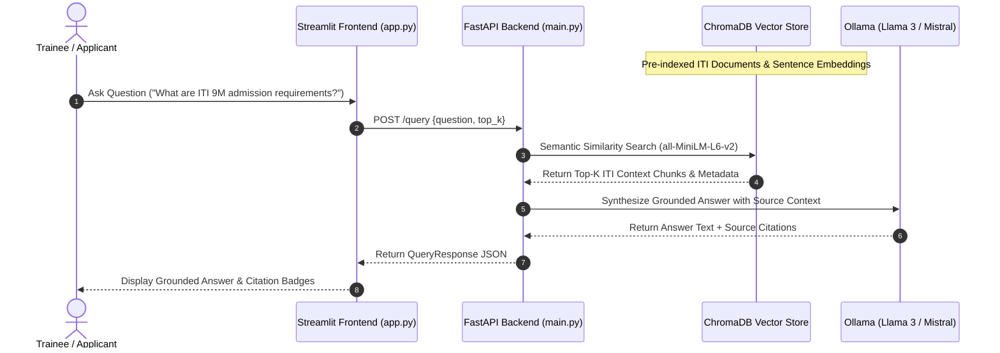

# 🎓 ITI RAG-Powered Document Assistant
### Information Technology Institute (معهد تكنولوجيا المعلومات) — https://iti.gov.eg

[](https://www.python.org/downloads/)
[](https://fastapi.tiangolo.com/)
[](https://streamlit.io/)
[](https://www.trychroma.com/)
[](LICENSE)

A complete end-to-end Retrieval-Augmented Generation (RAG) web application built for **Information Technology Institute (ITI - معهد تكنولوجيا المعلومات)** documentation question answering. The system ingests Markdown, Text, and PDF documents covering ITI training programs (9-Month Diploma, Intensive Code Camp ICC), admission criteria, governorate Creativa hubs, and student regulations, serving grounded, cited answers via a **FastAPI** backend and **Streamlit** chat interface.

---

## 🏗️ System Architecture



---

## 🛠️ Tech Stack

| Component | Technology | Description |
| :--- | :--- | :--- |
| **Language** | Python 3.10+ | Core development language |
| **Vector Database** | ChromaDB | Persistent high-dimensional vector storage |
| **Embedding Model** | `all-MiniLM-L6-v2` | SentenceTransformers dense embeddings (CPU) |
| **LLM Inference** | Ollama (`llama3` / `mistral`) | Local LLM answer generation engine |
| **Backend API** | FastAPI + Uvicorn | High-performance asynchronous REST API |
| **Frontend UI** | Streamlit | Interactive web chat user interface |
| **Testing** | Pytest + HTTPX | Automated API unit and integration testing |
| **Containerization** | Docker | Production container image packaging |

---

## 📁 Project Structure

```text
rag-assistant-project/
├── notebooks/
│   └── rag_pipeline.ipynb         # Complete pipeline (Ingest, Chunk, Embed, Evaluate, Export)
├── backend/
│   ├── app/
│   │   ├── main.py                # FastAPI app, CORS, lifespan loading
│   │   ├── api/routes/query.py    # GET /health, POST /query
│   │   ├── core/config.py         # Settings from .env via pydantic-settings
│   │   ├── schemas/query.py       # QueryRequest / QueryResponse models
│   │   ├── services/
│   │   │   ├── retrieval.py       # Vector store loading & similarity search
│   │   │   └── generation.py      # LLM prompt synthesis with Ollama
│   │   └── utils/logging_config.py# Centralized logger configuration
│   ├── data/vector_store/         # Persisted ChromaDB vector database
│   ├── tests/test_query.py        # Pytest suite with TestClient
│   ├── requirements.txt           # Backend dependencies
│   ├── .env.example               # Environment variables template
│   └── Dockerfile                 # Docker container build file
├── frontend/
│   ├── app.py                     # Streamlit chat user interface
│   ├── api_client.py              # API client wrapper reading API_BASE_URL
│   ├── .env                       # Frontend environment configuration
│   ├── .env.example
│   └── requirements.txt           # Frontend dependencies
├── data/
│   └── raw_documents/             # ITI Domain source corpus
│       ├── iti_overview_and_programs.md
│       ├── iti_admission_and_branches.md
│       └── iti_student_handbook.pdf
├── .gitignore                     # Git exclusion rules
├── requirements.txt               # Unified project dependencies
└── README.md                      # Complete documentation
```

---

## 📖 Domain & Data Description

The assistant is trained on **Information Technology Institute (ITI)** source documentation:
1. `iti_overview_and_programs.md`: Overview of ITI (operating under MCIT), 9-Month Professional Training Program, Intensive Code Camp (ICC), University Summer Training, E-learning Mahara-Tech platform, and specialized tracks (AI, Cloud, Software Engineering, Cybersecurity, Embedded Systems).
2. `iti_admission_and_branches.md`: Eligibility criteria (Egyptian nationality, Bachelor degree, military status), admission examination stages (English test, IQ test, Technical interview), and branch locations (Smart Village HQ, Creativa Governorates Hubs).
3. `iti_student_handbook.pdf`: Student attendance regulations (85% minimum), grading criteria, graduation project weight (40%), and annual job fairs.

---

## 🚀 Quickstart & Setup Guide

### 1. Prerequisites
- Python 3.10+
- Git
- Ollama (Optional for local LLM execution: `ollama pull llama3`)

### 2. Environment Setup
```bash
# Clone the repository
git clone https://github.com/<your-username>/rag-assistant-app.git
cd rag-assistant-app

# Create virtual environment
python3 -m venv .venv
source .venv/bin/activate  # On Windows: .venv\Scripts\activate

# Install unified requirements
pip install -r requirements.txt
```

### 3. Generate Vector Database (Notebook execution)
```bash
jupyter lab notebooks/rag_pipeline.ipynb
# Run all cells top-to-bottom to build and export vector store to backend/data/vector_store
```

### 4. Run Backend Server (FastAPI)
```bash
cd backend
cp .env.example .env
PYTHONPATH=. uvicorn app.main:app --reload --port 8000
```
- API Documentation: `http://localhost:8000/docs` (Swagger UI)
- Health Check: `http://localhost:8000/health`

### 5. Run Frontend Interface (Streamlit)
Open a new terminal window:
```bash
cd frontend
cp .env.example .env
streamlit run app.py --server.port 8501
```
- Open browser at `http://localhost:8501`

---

## 📡 API Reference & `curl` Examples

### 1. Health Check (`GET /health`)
```bash
curl -X GET "http://localhost:8000/health"
```

### 2. Query ITI Assistant (`POST /query`)
```bash
curl -X POST "http://localhost:8000/query" \
     -H "Content-Type: application/json" \
     -d '{
           "question": "What are the admission requirements for the ITI 9-Month program?",
           "top_k": 3
         }'
```
**Response (200 OK):**
```json
{
  "question": "What are the admission requirements for the ITI 9-Month program?",
  "answer": "To apply for ITI 9-Month training grants, candidates must be Egyptian nationals holding a Bachelor's degree from a recognized university within the last 5 graduation years, with completed/exempted military status for males, and full-time commitment.",
  "sources": [
    "iti_admission_and_branches.md"
  ],
  "retrieved_chunks": [
    {
      "content": "To apply for ITI training grants...",
      "metadata": { "source": "iti_admission_and_branches.md" },
      "source": "iti_admission_and_branches.md",
      "score": 0.912
    }
  ]
}
```

---

## 🧪 Evaluation Results Summary (Notebook 2.6)

| Question | Top Retrieved Source | Grounded Status |
| :--- | :--- | :---: |
| What is the Information Technology Institute (ITI)? | `iti_overview_and_programs.md` | ✅ Yes |
| What are the target audience and duration of the 9M Program? | `iti_overview_and_programs.md` | ✅ Yes |
| What is the Intensive Code Camp (ICC)? | `iti_overview_and_programs.md` | ✅ Yes |
| What are the admission stages for ITI training grants? | `iti_admission_and_branches.md` | ✅ Yes |
| Which entrance exams are required during ITI selection? | `iti_admission_and_branches.md` | ✅ Yes |
| Where are ITI branches and Creativa Hubs located? | `iti_admission_and_branches.md` | ✅ Yes |
| What is the Mahara-Tech e-learning platform? | `iti_overview_and_programs.md` | ✅ Yes |
| What is the minimum mandatory attendance percentage? | `iti_student_handbook.pdf` | ✅ Yes |

---

## 🧪 Running Automated Tests
Run backend test suite with Pytest:
```bash
cd backend
PYTHONPATH=. pytest tests/
```

---

## 📄 License
This project is released under the MIT License.
